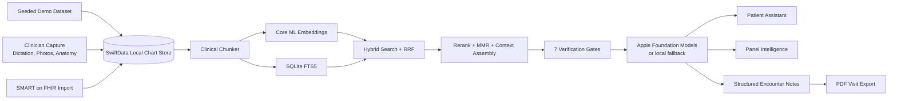

# OpenClinic

OpenClinic is a provider-facing, local-first clinical workspace built with SwiftUI and SwiftData for iPhone, iPad, macOS, and visionOS. It combines patient charting, encounter documentation, clinical photography, lesion tracking, SMART on FHIR import, PDF note export, and on-device clinical intelligence inside a single Apple-native app shell.

The repo is currently best understood as a serious prototype and architecture playground for modern clinical software on Apple platforms. It is not production-hardened, not a substitute for clinician judgment, and not ready for real-world deployment without significant security, compliance, validation, and operational work.

## Table of Contents

- [What OpenClinic Is](#what-openclinic-is)
- [Core Capabilities](#core-capabilities)
- [How the App Is Organized](#how-the-app-is-organized)
- [Architecture](#architecture)
- [On-Device AI and RAG](#on-device-ai-and-rag)
- [Interoperability and Provenance](#interoperability-and-provenance)
- [Data Model](#data-model)
- [Repository Layout](#repository-layout)
- [Platform Support](#platform-support)
- [Getting Started](#getting-started)
- [Using Live SMART on FHIR Import](#using-live-smart-on-fhir-import)
- [Privacy and Local-First Design](#privacy-and-local-first-design)
- [Current Limitations](#current-limitations)
- [Contributing](#contributing)
- [Security](#security)
- [License](#license)

## What OpenClinic Is

OpenClinic is built around a simple idea: a clinical app should feel like a working chart room, not a loose pile of disconnected screens.

In practical terms, this repository contains:

- A multi-tab clinical workspace for schedule review, patient charts, encounter workflows, messaging-style inboxes, and connectivity settings.
- A local chart store powered by SwiftData for patients, clinical records, medications, appointments, and clinical photos.
- An encounter workspace that turns dictation plus anatomical context into structured notes.
- A hybrid retrieval and generation pipeline that runs retrieval, reranking, verification, and chart question answering on-device.
- A SMART on FHIR import flow that can pull live patient context into the local workspace.
- Dermatology-forward workflows such as anatomical body maps, photo capture, and lesion progression timelines.

The current UX leans dermatology-heavy, but the underlying shell is broader than that. The chart model, interoperability layer, provenance model, and intelligence workflow are general enough to support other specialties with additional domain-specific views.

## Core Capabilities

| Area                  | What it does                                                                                                  |
| --------------------- | ------------------------------------------------------------------------------------------------------------- |
| Agenda                | Shows the day schedule, workflow status progression, and patient routing through a clinic day.                |
| Patient chart         | Provides chart summary, visits, medications, imaging, and tools inside a single patient workspace.            |
| Encounter workspace   | Captures dictation, anatomy focus, and AI-generated structured notes with draft, reviewed, and signed states. |
| Clinical imaging      | Supports photo library import, camera capture, region tagging, lesion timelines, and body-map navigation.     |
| Clinical intelligence | Answers patient-scoped or panel-wide questions from the local chart using on-device retrieval and generation. |
| Interoperability      | Imports Patient, Condition, MedicationRequest, and Appointment resources from SMART on FHIR servers.          |
| Provenance            | Tracks where data came from, whether it is authoritative, and when it was last synced.                        |
| PDF export            | Generates a visit-note PDF from structured record content after documentation is signed.                      |
| Messaging prototype   | Includes an inbox-style workflow surface for internal communication concepts.                                 |

## How the App Is Organized

OpenClinic's main shell is organized around five top-level tabs:

- `Agenda`: a workflow-centric daily schedule with status grouping, quick filtering, and swipe-based progression.
- `Patient`: an iPhone list and iPad split-view chart experience for navigating patient records.
- `Intelligence`: a panel-wide or patient-specific clinical assistant powered by local retrieval and on-device generation.
- `IntraMail`: a prototype inbox surface for internal workflow messages.
- `Settings`: workspace state, RAG indexing, and live SMART / EHR import controls.

Within the patient chart, the main sections are:

- `Summary`: chart overview, active problems, appointment context, alerts, and action lane.
- `Visits`: recent notes and timeline review.
- `Meds`: active prescriptions and medication workflow.
- `Imaging`: clinical photos, lesion tracking, and anatomical body map.
- `Tools`: encounter workspace, intelligence, and interoperability entry points.

## Architecture



At a high level, OpenClinic keeps a local working chart in SwiftData, enriches that chart with optional live SMART/FHIR imports, and then builds its intelligence features on top of local retrieval rather than cloud-only prompting.

Important design choices in the current codebase:

- The app reindexes the local RAG corpus on launch.
- Demo records and imported live records can coexist in the same workspace.
- Source badges are attached throughout the UI so it is clear whether data is demo, imported, captured locally, or AI-produced.
- Generation prefers Apple's on-device Foundation Models APIs when available and falls back to local non-FoundationModels code paths when they are not.

## On-Device AI and RAG

OpenClinic's intelligence layer is not just a single prompt wrapper. The repository contains a full on-device retrieval stack with its own chunking, vector search, keyword search, reranking, verification, and UI traceability.

### Generation

- Uses Apple's Foundation Models APIs when the target OS and device support them.
- Generates structured encounter notes as typed outputs, not just loose text blobs.
- Supports patient-scoped chart Q&A and panel-wide queries.
- Falls back when Foundation Models are unavailable so the app still functions on less capable configurations.

### Retrieval

- Uses a bundled Core ML embedding model from `OpenClinic/Resources/MLModels/EmbeddingModel.mlpackage`.
- Includes a bundled tokenizer vocabulary in `embedding_vocab.json`.
- Stores vectors locally through `ClinicalVectorStore`.
- Uses SQLite FTS5 through `ClinicalFTSService` for keyword recall.
- Merges semantic and keyword retrieval using reciprocal rank fusion.

### Reranking and Context Assembly

- Optionally reranks results with a second bundled Core ML model from `OpenClinic/Resources/MLModels/ReRankerModel.mlpackage`.
- Applies diversity-aware chunk selection.
- Reorders context to reduce the classic lost-in-the-middle problem.
- Tracks chunk counts, timing, and retrieval metadata for the UI.

### Verification

Every verified RAG query runs seven safety and grounding checks:

- Retrieval confidence
- Evidence coverage
- Numeric sanity
- Contradiction sweep
- Semantic grounding
- Quote faithfulness
- Generation quality

Those checks roll up into a confidence tier that is exposed in the clinical intelligence UI.

### Deep Think Mode

The repo also includes an optional multi-pass retrieval mode that performs follow-up search passes before synthesis. In the current UI this appears as a toggle between standard retrieval and a deeper multi-pass mode.

## Interoperability and Provenance

OpenClinic includes a full SMART on FHIR import surface rather than a raw token box and some network calls.

### What it supports today

- SMART discovery from the server's well-known configuration.
- FHIR capability statement inspection.
- In-app OAuth via `ASWebAuthenticationSession`.
- Default SMART sandbox workflow with a built-in public client setup.
- Manual bearer-token fallback for controlled demos or recovery cases.
- Import of these resource types into the local workspace:
  - `Patient`
  - `Condition`
  - `MedicationRequest`
  - `Appointment`

### Provenance model

Every major clinical entity can carry source metadata, including:

- `sourceKind`
- `sourceSystemName`
- `sourceRecordIdentifier`
- `sourceLastSyncedAt`
- `sourceOfTruth`

Current source kinds in the codebase include:

- Demo cache
- SMART on FHIR
- Clinician captured
- Patient generated
- Device import
- Manual entry
- Local AI
- Mixed sources

This matters because OpenClinic is opinionated about showing clinicians where data came from instead of flattening everything into one indistinguishable record layer.

## Data Model

The primary SwiftData entities are:

| Model                 | Purpose                                                                                  |
| --------------------- | ---------------------------------------------------------------------------------------- |
| `PatientProfile`      | Core patient demographic and chart container.                                            |
| `LocalClinicalRecord` | Visit notes, diagnoses, structured documentation fields, and follow-up planning.         |
| `LocalMedication`     | Medication details, refill context, safety notes, and provenance.                        |
| `Appointment`         | Schedule items, workflow status, visit reason, and optional clinician/location metadata. |
| `ClinicalPhoto`       | Captured images, anatomical region, notes, and source metadata.                          |

Documentation lifecycle in the current app is explicit:

- `Draft`
- `Reviewed`
- `Signed`

That lifecycle appears in both the encounter workflow and the visit-detail review surfaces.

## Repository Layout

```text
OpenClinic/
├── OpenClinic.xcodeproj/
├── Info.plist
├── OpenClinic.entitlements
└── OpenClinic/
    ├── AI/
    │   └── ClinicalIntelligenceService.swift
    ├── Interop/
    │   ├── FHIR/
    │   ├── Provenance/
    │   └── SMART/
    ├── Models/
    ├── RAG/
    ├── Resources/
    │   └── MLModels/
    ├── Services/
    └── Views/
```

If you are trying to understand the repo quickly, these files are the best starting points:

- `OpenClinic/OpenClinicApp.swift`: app entry, schema setup, launch-time reindex.
- `OpenClinic/ContentView.swift`: initial app boot behavior and demo data seeding.
- `OpenClinic/Views/EHRMainShellView.swift`: high-level app navigation.
- `OpenClinic/Views/PatientDashboardView.swift`: patient chart UX.
- `OpenClinic/Views/ClinicalExamView.swift`: encounter workflow and note generation.
- `OpenClinic/Views/ClinicIntelligenceView.swift`: panel and patient intelligence UX.
- `OpenClinic/Interop/SMART/SMARTConnectionController.swift`: SMART auth/import orchestration.
- `OpenClinic/Interop/FHIR/FHIRImportService.swift`: FHIR import pipeline.
- `OpenClinic/RAG/ClinicalRAGService.swift`: RAG orchestration.
- `OpenClinic/RAG/ClinicalEmbeddingService.swift`: on-device embedding pipeline.
- `OpenClinic/RAG/VerificationGates.swift`: response verification logic.

## Platform Support

As currently configured in the Xcode project:

- iOS deployment target: `26.2`
- macOS deployment target: `26.2`
- visionOS deployment target: `26.2`
- Project toolchain metadata: Xcode `26.3`
- Supported platforms: iPhone, iPad, macOS, visionOS

This is a bleeding-edge Apple SDK target line. If your local toolchain does not include the same SDK generation, you should expect to retarget deployment versions and validate any Foundation Models availability before the project will build cleanly.

Dependency-wise, the repository is intentionally lean:

- No CocoaPods
- No third-party Swift packages checked into the repo
- No package-resolved dependency graph in the repository
- Primary stack is Apple-native: SwiftUI, SwiftData, Combine, Core ML, NaturalLanguage, AuthenticationServices, PhotosUI, Speech, AVFoundation, and related system frameworks

## Getting Started

### Requirements

- A Mac with a current Xcode toolchain that matches, or can be adapted to, the project's 26.x deployment settings.
- Apple platform simulator runtimes or physical devices for the platform you want to target.
- A development team configured in Xcode if you want to run on device.

### Build steps

1. Clone the repository.
2. Open `OpenClinic.xcodeproj` in Xcode.
3. Select the `OpenClinic` target.
4. Update signing settings if your environment requires a different bundle identifier or team.
5. Choose a simulator or device.
6. Build and run.

### First launch behavior

On first run, the app will:

- Initialize the SwiftData schema.
- Seed a local demo dataset if no patients exist yet.
- Reindex the local retrieval corpus.

That means you can explore most of the product without connecting to any external clinical system.

### Permissions you should expect

- Speech recognition and microphone permission on iOS for dictation workflows.
- Photo library or camera permission when capturing clinical images.

## Using Live SMART on FHIR Import

The app already contains a live import workspace. You do not need to bolt a separate sandbox client onto it just to explore the basic flow.

### Recommended flow

1. Launch the app.
2. Open `Settings`.
3. Open `Live SMART / EHR Import`.
4. Keep the default sandbox preset, or enter a SMART-compatible FHIR base URL.
5. Use the in-app SMART sign-in path.
6. Import the current launch patient after authorization completes.

### What gets imported

- Patient demographics
- Condition history
- Medication requests
- Appointments

Imported resources are adapted into the local SwiftData models and surfaced with provenance badges in the UI.

### If you customize OAuth

If you swap the default sandbox setup for your own SMART application registration, make sure the client registration, callback scheme, and app configuration stay aligned. The repo includes a legacy callback setup in code and plist configuration that should be treated as a matched set if you change it.

## Privacy and Local-First Design

The current product direction is intentionally local-first.

What stays on device in this codebase:

- The SwiftData chart store
- Clinical photo storage
- Embedding generation
- Vector storage
- Full-text index
- Retrieval and reranking
- Verification gates
- Foundation-model note generation and chart Q&A when supported by the device and OS

Where network access enters the picture today:

- SMART authorization
- FHIR discovery and metadata fetches
- Live FHIR resource import

That separation is one of the core architectural ideas in the repository: external systems can hydrate the workspace, but the workspace itself is designed to function locally once data is present.

## Current Limitations

This repo is already substantial, but it is still rough in important ways.

- It is a prototype, not a production deployment.
- The demo dataset is heavily dermatology-oriented and shapes much of the current UX.
- FHIR support is import-only right now. There is no visible outbound writeback path in the repo.
- Clinical intelligence is grounded and verified, but it is still assistance software and should not be treated as autonomous clinical judgment.
- Speech dictation is currently an iOS-only workflow.
- The visionOS target exists, but the current anatomy/body-map experience is still a 2D UI rather than a spatial computing experience.
- The Xcode target settings are ahead of what many environments will have installed.
- Some project metadata still reflects earlier experiments, while the active chart ingestion path in the app code is local demo data plus SMART/FHIR import.
- There is no backend service layer, multi-user sync, enterprise auth stack, audit system, or production compliance posture in this repository yet.

## Contributing

See [CONTRIBUTING.md](CONTRIBUTING.md) for contribution expectations, PR scope guidance, validation notes, and data-handling rules.

## Security

See [SECURITY.md](SECURITY.md) for private vulnerability reporting guidance and rules for handling sensitive data in reports.

## Why This Repo Is Interesting

If you care about Apple-native health software, OpenClinic is interesting for reasons beyond the UI:

- It shows what a modern clinical workspace can look like with SwiftUI instead of a webview wrapper.
- It treats provenance as a first-class UI concern.
- It combines retrieval, grounding, and typed generation instead of stopping at a chatbot.
- It keeps the intelligence stack close to the device.
- It demonstrates a path from local prototype data to live interoperable import without throwing away the rest of the app.

## License

There is currently no license file in this repository.

If you plan to open the project up to outside use, forks, or contributions, adding an explicit license should be one of the first cleanup tasks.
